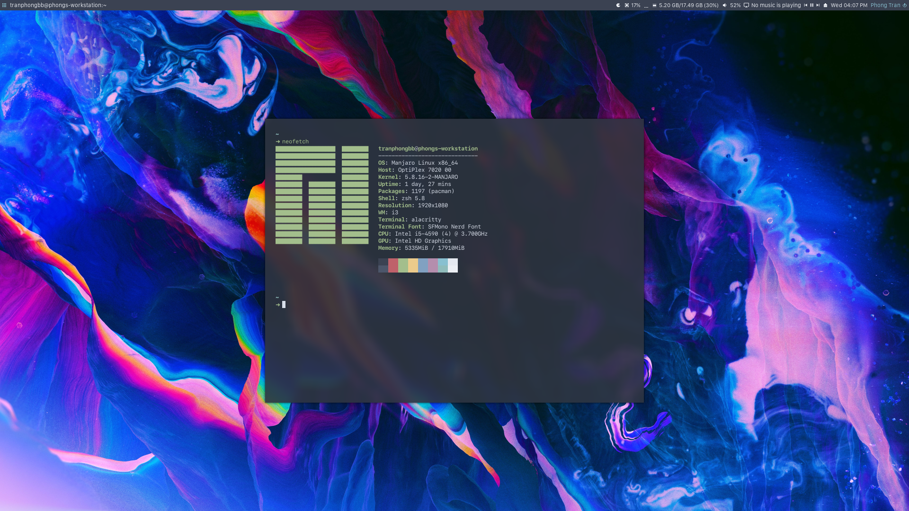

# Dots
Dotfiles to conquer.

### Setup
- OS: [Manjaro 20.1 Mikah](https://manjaro.org/)
- WM: [i3-gaps](https://github.com/Airblader/i3) - [config](https://github.com/bodetaima/dots/blob/master/i3/config)
- Status bar: [polybar](https://github.com/polybar/polybar) - [config](https://github.com/bodetaima/dots/tree/master/polybar)
- Window Switcher: [rofi](https://github.com/davatorium/rofi) - [config](https://github.com/bodetaima/dots/blob/master/rofi/config.rasi)
- Terminal: [alacritty](https://github.com/alacritty/alacritty) - [config](https://github.com/bodetaima/dots/blob/master/alacritty/alacritty.yml)
- Text Editor: [neovim](https://neovim.io/) - [config](https://github.com/bodetaima/dots/blob/master/nvim/init.vim)
- Font Family: [SFMono Nerd Font](https://github.com/bodetaima/dots/tree/master/fonts)
- Colorscheme: [Nord](https://www.nordtheme.com/)
